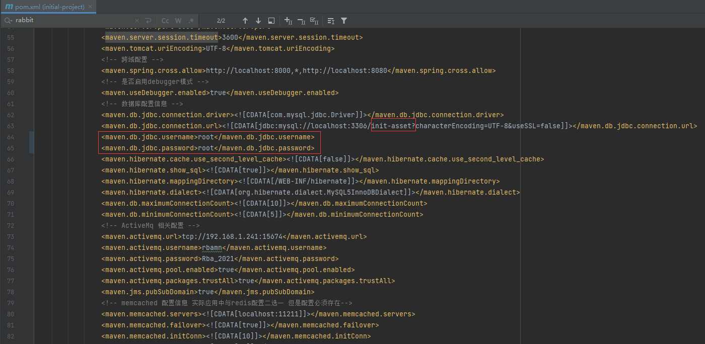
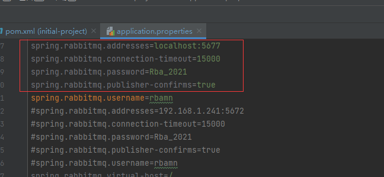
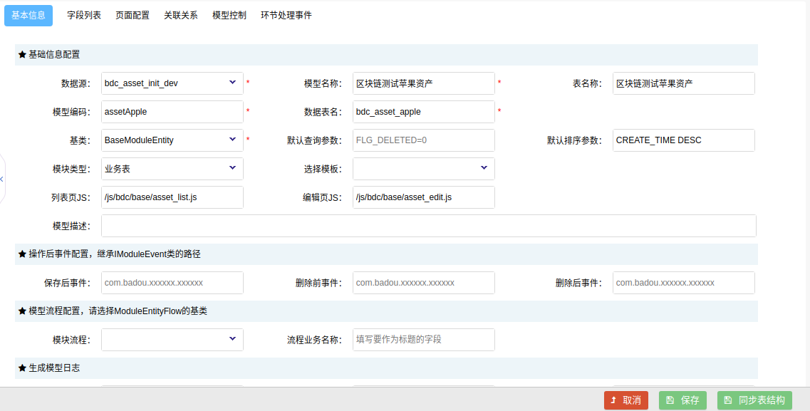

# 资产demo开发帮助手册
*存放路径不要存在中文*

### 1 ) 项目启动

#### 1.1 项目依赖软件
- node v12.18.0
- jdk8
- mysql5.7
- rabbit mq
- memcache

#### 1.2 导入本地数据库
数据库脚本文件位于：
`doc -> sql -> init-asset.sql`

#### 1.3 修改pom文件中配置

mysql数据库 -> 将账号密码改成本地访问地址以及账号密码



附件存储路径修改 -> 将附件存储地址调整为本机地址


memcache配置修改 -> 将memcache中的配置调整为可访问的memcache地址


#### 1.4 修改application.properties文件

将rabbitmq的配置调整为本机可访问的地址



#### 1.5 启动项目


### 2 ) 模型配置

> 资产必须含有一个唯一性的资产主键ID

例:现有这样一个数据结构,名为苹果资产,资产主键ID为apple_id

```javascript
apple_id 苹果id,apple_name 苹果名称 
```

基础数据库表结构如下:

```mysql
  CREATE TABLE `asset_example` (
                                   `ID` varchar(64) NOT NULL COMMENT '表主键ID',
                                   `creator_name` varchar(255) DEFAULT NULL COMMENT '创建者名称',
                                   `creator` varchar(255) DEFAULT NULL COMMENT '创建者ID',
                                   `create_time` datetime NOT NULL DEFAULT '0000-00-00 00:00:00' COMMENT '创建时间',
                                   `updator_name` varchar(255) DEFAULT NULL COMMENT '修改者名称',
                                   `updator` varchar(255) DEFAULT NULL COMMENT '修改者ID',
                                   `update_time` datetime NOT NULL DEFAULT '0000-00-00 00:00:00' COMMENT '修改时间',
                                   `flg_deleted` int(2) DEFAULT NULL COMMENT '逻辑删除符',
                                   `asset_code` varchar(64) DEFAULT NULL COMMENT '资产编码',
                                   `asset_name` varchar(255) DEFAULT NULL COMMENT '资产名称',
                                   `mdCode` varchar(255) DEFAULT NULL COMMENT '资产模型编码',
                                   `upload_type` int(11) DEFAULT NULL COMMENT '上传方式',
                                   `upload_time` datetime DEFAULT NULL COMMENT '上链时间',
                                   `bdc_baas_log_id` varchar(255) DEFAULT NULL COMMENT 'baas平台日志ID',
                                   `upload_status` int(11) DEFAULT NULL COMMENT '上链状态',
                                   `hash` varchar(255) DEFAULT NULL COMMENT '区块链hash',
                                   `is_create` int(11) DEFAULT NULL COMMENT '是否已初始化到区块链'
  ) ENGINE=InnoDB DEFAULT CHARSET=utf8;
```

需要添加的字段

```mysql
  `APPLE_ID` varchar(32) NOT NULL COMMENT '苹果id',
  `APPLE_NAME` varchar(200) DEFAULT NULL COMMENT '苹果名称',
```


#### 2.1 编写实体类

```java
public class AppleEntity extends BaseAssetEntity { //新增的资产统一继承于BaseAssetEntity
    /**
     * 苹果id
     */
    @Column(name = "APPLE_ID")
    protected String appleId;
    /**
     * 苹果名称
     */
    @Column(name = "APPLE_NAME")
    protected String appleName;
}
```


#### 2.2 修改资产类型枚举 UploadTypeEnum

将苹果资产信息添加到资产类型枚举类,后面的操作都是根据枚举类获取资产对应的service进行操作,以及上链服务,所以这一步是必须的

```java
public enum UploadTypeEnum {
    /**
     * 添加苹果资产信息
     * APPLE为资产编码对应assetCode
     * 苹果为资产名称对应assetName
     */
    APPLE("APPLE", "苹果", AppleEntity.class)
}
```


#### 2.3 编写dao和service类

```java
//dao 省略...

//service 接口省略...

//service 实现类
//必须加上此注解,以区分类型,应用启动时扫描带有此注解的service并添加到缓存,便于后面的上链操作
@UploadAssetTypeHandler(UploadTypeEnum.APPLE)
public class AppleServiceImpl extends
        BaseSpringService<AppleEntity, Serializable> implements IAppleService {
}
```


#### 2.4 编写上链服务service类

```java
//上链服务接口
public interface IAppleUploadService extends IBaseUploadAssetService {
}

//上链服务实现类
//必须加上此注解,以区分类型,应用启动时扫描带有此注解的service并添加到缓存,便于后面的上链操作
@UploadAssetTypeHandler(UploadTypeEnum.APPLE)
public class AppleUploadServiceImpl extends BaseUploadAssetServiceImpl implements IAppleUploadService {
}
```


#### 2.5 配置模型,用于展示页面

在模型中找到资产的模板,根据该模板复制一份新的模型配置,根据业务具体修改相应模型名称,模型编码等等...


例如下图:




### 3 ) 新建菜单

前往 系统管理 -> 角色权限 -> 菜单管理

选择区块链交易设计器 -> 新增


URL填写规则:

module/stander/list?mdCode=assetApple&symbol=placeholder 直接复制将mdCode的值改为模型配置的编码即可

> 注意:菜单新增完需要前往 菜单管理同级下的角色权限分配(当前登录用户为SA)对相关的角色进行授权并保存,否则可能会出现菜单新增完页面上不出现的问题,如果没问题请忽略这句话
