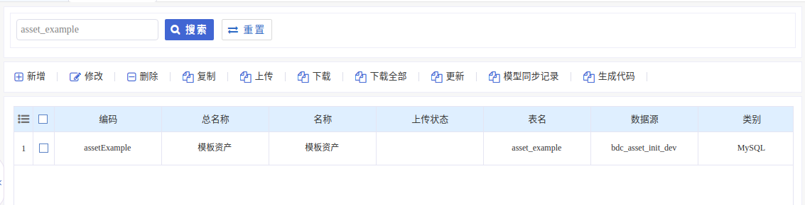

# 资产demo开发帮助手册

### 1 ) 模型配置

> 资产必须含有一个唯一性的资产主键ID

例:现有这样一个数据结构,名为苹果资产,资产主键ID为apple_id

```javascript
apple_id 苹果id,apple_name 苹果名称 
```

基础数据库表结构如下:

```mysql
  CREATE TABLE `asset_example` (
  `ID` varchar(64) NOT NULL COMMENT '表主键ID',
  `creator_name` varchar(255) DEFAULT NULL COMMENT '创建者名称',
  `creator` varchar(255) DEFAULT NULL COMMENT '创建者ID',
  `create_time` datetime NOT NULL DEFAULT '0000-00-00 00:00:00' COMMENT '创建时间',
  `updator_name` varchar(255) DEFAULT NULL COMMENT '修改者名称',
  `updator` varchar(255) DEFAULT NULL COMMENT '修改者ID',
  `update_time` datetime NOT NULL DEFAULT '0000-00-00 00:00:00' COMMENT '修改时间',
  `flg_deleted` int(2) DEFAULT NULL COMMENT '逻辑删除符',
  `asset_code` varchar(64) DEFAULT NULL COMMENT '资产编码',
  `asset_name` varchar(255) DEFAULT NULL COMMENT '资产名称',
  `mdCode` varchar(255) DEFAULT NULL COMMENT '资产模型编码',
  `upload_type` int(11) DEFAULT NULL COMMENT '上传方式',
  `upload_time` datetime DEFAULT NULL COMMENT '上链时间',
  `bdc_baas_log_id` varchar(255) DEFAULT NULL COMMENT 'baas平台日志ID',
  `upload_status` int(11) DEFAULT NULL COMMENT '上链状态',
  `hash` varchar(255) DEFAULT NULL COMMENT '区块链hash',
  `is_create` int(11) DEFAULT NULL COMMENT '是否已初始化到区块链'
   ) ENGINE=InnoDB DEFAULT CHARSET=utf8;
```

需要添加的字段

```mysql
  `APPLE_ID` varchar(32) NOT NULL COMMENT '苹果id',
  `APPLE_NAME` varchar(200) DEFAULT NULL COMMENT '苹果名称',
```


#### 1.1 编写实体类

```java
public class AppleEntity extends BaseAssetEntity { //新增的资产统一继承于BaseAssetEntity
	/**
     * 苹果id
     */
	@Column(name = "APPLE_ID")
    protected String appleId;
	/**
     * 苹果名称
     */
	@Column(name = "APPLE_NAME")
    protected String appleName;
}
```


#### 1.2 修改资产类型枚举 UploadTypeEnum

将苹果资产信息添加到资产类型枚举类,后面的操作都是根据枚举类获取资产对应的service进行操作,以及上链服务,所以这一步是必须的

```java
public enum UploadTypeEnum {
    /**
     * 添加苹果资产信息
     * APPLE为资产编码对应assetCode
     * 苹果为资产名称对应assetName
     */
    APPLE("APPLE", "苹果", AppleEntity.class)
}
```


#### 1.3 编写dao和service类

```java
//dao 省略...

//service 接口省略...

//service 实现类
//必须加上此注解,以区分类型,应用启动时扫描带有此注解的service并添加到缓存,便于后面的上链操作
@UploadAssetTypeHandler(UploadTypeEnum.APPLE) 
public class AppleServiceImpl extends
		BaseSpringService<AppleEntity, Serializable> implements IAppleService {
}
```


#### 1.4 编写上链服务service类

```java
//上链服务接口
public interface IAppleUploadService extends IBaseUploadAssetService {
}

//上链服务实现类
//必须加上此注解,以区分类型,应用启动时扫描带有此注解的service并添加到缓存,便于后面的上链操作
@UploadAssetTypeHandler(UploadTypeEnum.APPLE)
public class AppleUploadServiceImpl extends BaseUploadAssetServiceImpl implements IAppleUploadService {
}
```


#### 1.5 配置模型,用于展示页面

在模型中找到资产的模板,根据该模板复制一份新的模型配置,根据业务具体修改相应模型名称,模型编码等等...



例如下图:


### 2 ) 新建菜单

前往 系统管理 -> 角色权限 -> 菜单管理 

选择区块链交易设计器 -> 新增


URL填写规则:

module/stander/list?mdCode=assetApple&symbol=placeholder 直接复制将mdCode的值改为模型配置的编码即可

> 注意:菜单新增完需要前往 菜单管理同级下的角色权限分配(当前登录用户为SA)对相关的角色进行授权并保存,否则可能会出现菜单新增完页面上不出现的问题,如果没问题请忽略这句话