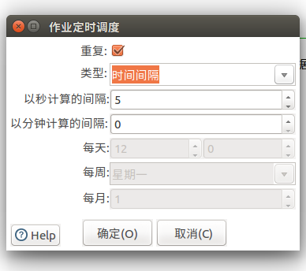

## 步骤说明(copyDataJob):

#### 		1 ) 表输入:数据的来源

**第一步:需要先连接上数据库**

IP地址:192.168.1.200

用户名:blockchain

密码:bc_2@2O^_^

对应的数据库:开发环境bdc_asset_init , 测试环境bdc_asset_init_test 

**第二步:在SQL栏编写SQL语句,可以直接点击获取SQL查询语句**

SELECT ID,user_name,proposal_date,mobile_name,org_name,org_id,datas,title
FROM **bdc_proposal_info_copy**[来源表]

**第三步:配置数量限制也就是每次执行查询多少条记录**

#### 2 ) 增加默认字段:创建者和修改者等信息,默认是SA用户,这个可以不用改

#### 3 ) 生成修改/创建时间:获取系统当前的时间作为数据的创建时间和修改时间,这个不用改

#### 4 ) 增加资产信息:也就是资产定义里面的接口的信息

​		**说明:**

​		根据实际的情况修改,对应的资产定义里面的字段

​		asset_name:资产名称

​		asset_code:资产编码

​		mdCode:资产模型编码 (目前可选的就三个: assetApple,assetdemo,ProposalInfo)

​		upload_status:上链状态 默认0就是未上链

#### 5 ) 生成UUID:生成表字段ID的值,不用改

#### 6 ) 插入/更新:输出位置

**说明:**

要把数据输出到的某个位置,目标表:具体的表,比如把bdc_proposal_info_copy(来源表) 的数据复制到bdc_proposal_info(目标表)

**提交记录数量:**对应表输入的记录数量限制,保持一致就行

**查询的关键字:**分别对应两张表的主键,也就是来源表的**ID**字段和输入表的**title_id**字段,如果输出表中title_id不存在来源表中ID的值则执行插入操作否则执行更新同时upload_status置为0

**更新字段:**来源表和输出表的字段映射关系,Y为每次执行更新,N为不更新,在修改了字段的情况下需要修改这个映射关系

例: 第一行 把来源表字段ID的值对应到输出表title_id

​	  第二行 把来源表字段title的值对应到输出表title

# 定时作业调度(copyData)

#### 说明:

**START:定时器设置**

**类型:时间间隔**

以图为例,五秒执行一次操作,中间的复制数据就是一次具体的操作,如果勾选了重复就是每五秒定时执行一次,没有勾选则只执行一次

如果不按秒为单位,例:每五分钟执行一次,则需要把秒计算间隔改为0,分钟计算间隔改为5即可

**类型:天,周,月(不常用)**

天:每天的几点执行

周:每周的星期几执行

月:每月的几号执行

**类型:不需要定时**

立即执行

**复制数据:**就是一次具体的操作,操作定义在copyDataJob文件中

# 如何使用

